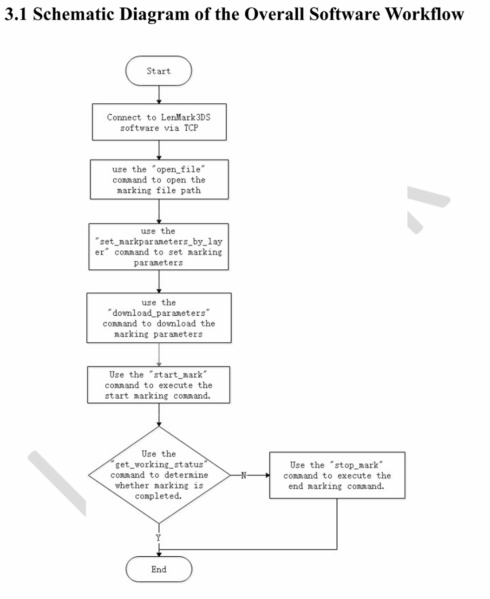

# LenMark Marking Software Manual

## 3DS Secondary Development - Network Port Communication

### Suzhou FEELTEK Laser Technology Co., Ltd.
**Address:**  
NO.36, Hua Da Road 3rd-5th floor,  
Building I, Zhangjiagang Free Trade Zone,  
Zhangjiagang, Jiangsu, China  

**Chinese Address:**  
苏州菲镭泰克激光技术有限公司  
地址：中国江苏张家港保税区科创园 I 栋 3-5 楼  

---

## 1. Document Properties

| Document Item   | LenMark marking software manual |
|----------------|--------------------------------|
| Document Name  | 3DS secondary development - network port communication |
| Document State | Finish |

## 2. Document Change Process

| Version Number | Revision Date |
|---------------|---------------|
| 2022.1.0     | 2022.4.27      |
| 2022.1.1     | 2022.7.19      |
| 2022.1.2     | 2022.10.21     |
| 2023.1.0     | 2023.9.6       |

*(Version number definition rules: year. major version number. minor version number)*

---

## Catalog

### 1. Overview

### 2. Interface Description
- **2.1** File Operation Class
- **2.2** Scanhead Operation
- **2.3** Parameter Operation
- **2.4** Primitive Operation Function
- **2.5** Input and Output Operation Functions
- **2.6** Alarm Operation
- **2.7** Visual Function
- **2.8** Stepper Motor Function

### 3. Interface Calling Process
- **3.1** Schematic Diagram of the Overall Software Workflow
- **3.2** CCD Calling Process Diagram
- **3.3** Motor Shaft Control Diagram

---

## 1. Overview

1. Based on TCP and IP protocols, the data message takes the form of a JSON data packet format string.
2. This interface serves as a TCP server, listening on port **50000**.
3. Each function is completed through a **Request** and a **Return**.

---

## 2. Interface Description

### 2.1 File Operation Class

1. Open File

| Function  | open file |
|-----------|-----------|
| Parameter | Path; file path |
| Returned  | ret |
| Value     | 1: Successfully executed 0: Not executed -1: Failed to open -2: File does not exist |

**Request:**
```json
{
  "sid": 0,
  "cmd": "open_file",
  "data": {
    "path": "/document.emd"
  }
}
```

**Return:**
```json
{
  "sid": 0,
  "cmd": "open_file",
  "ret": 1
}
```

2. Close File

| Function  | Close file without saving |
|-----------|---------------------------|
| Parameter | none |
| Returned  | ret |
| Value     | 1: Execution successful 0: Not executed |

**Request:**
```json
{
  "sid": 0,
  "cmd": "close_file"
}
```

**Return:**
```json
{
  "sid": 0,
  "cmd": "close_file",
  "ret": 1
}
```

3. Save Document

| Function  | Save document |
|-----------|---------------|
| Parameter | Path; file path, canCover 0: Uncoverable 1: Coverable |
| Returned  | ret |
| Value     | 1: Saved successfully 0: Not executed -1: The file already exists, the operation is not allowed to overwrite -2: The file name is wrong |

**Request:**
```json
{
  "sid": 0,
  "cmd": "save_file",
  "data": {
    "path": "./document1.emd",
    "cover": 0
  }
}
```

**Return:**
```json
{
  "sid": 0,
  "cmd": "save_file",
  "ret": 1
}
```

### 2.2 Scanhead Operation

1. Software Running Status

| Function  | Get software running status |
|-----------|-----------------------------|
| Parameter | None |
| Returned  | ret |
| Value     | 0: Waiting 1: Marking 2: Previewing 3: Already working, marking or previewing not started yet |

**Request:**
```json
{
  "sid": 0,
  "cmd": "get_working_status"
}
```

**Return:**
```json
{
  "sid": 0,
  "cmd": "get_working_status",
  "ret": 1
}
```

2. Start Marking

| Function  | Start marking |
|-----------|---------------|
| Parameter | None |
| Returned  | ret |
| Value     | 1: Execution successful 0: Not executed |

**Request:**
```json
{
  "sid": 0,
  "cmd": "start_mark"
}
```

**Return:**
```json
{
  "sid": 0,
  "cmd": "start_mark",
  "ret": 1
}
```

3. Stop Marking

| Function  | Stop marking |
|-----------|--------------|
| Parameter | None |
| Returned  | ret |
| Value     | 1: Execution successful 0: Not executed |

**Request:**
```json
{
  "sid": 0,
  "cmd": "stop_mark"
}
```

**Return:**
```json
{
  "sid": 0,
  "cmd": "stop_mark",
  "ret": 1
}
```

4. Start Preview

| Function  | Start preview |
|-----------|---------------|
| Parameter | None |
| Returned  | ret |
| Value     | 1: Execution successful 0: Not executed |

**Request:**
```json
{
  "sid": 0,
  "cmd": "start_preview"
}
```

**Return:**
```json
{
  "sid": 0,
  "cmd": "start_preview",
  "ret": 1
}
```

5. Stop Preview

| Function  | Stop preview |
|-----------|--------------|
| Parameter | None |
| Returned  | ret |
| Value     | 1: Execution successful 0: Not executed |

**Request:**
```json
{
  "sid": 0,
  "cmd": "stop_preview"
}
```

**Return:**
```json
{
  "sid": 0,
  "cmd": "stop_preview",
  "ret": 1
}
```

### 2.3 Parameter Operation

1. Get the Marking Parameter Based on the Layer Number

| Function  | Get the marking Parameter based on the layer number |
|-----------|-----------------------------------------------------|
| Parameter | layer_id Layer number |
| Returned  | ret |
| Value     | Layer index 0 — 254, Marking speed, Jump speed, Jump delay, Light on delay, Polygon delay, Laser off delay, Polygon killer time, Laser frequency, YAG, SPI current (A) IPG energy (%), AG first pulse suppression pulse width, Pulse width(us), CO2 first pulse width (%), CO2 first pulse suppression increment step size (%) |

**Request:**
```json
{
  "sid": 0,
  "cmd": "get_markParameters_by_layer",
  "data": {
    "layer_id": 1
  }
}
```

**Return:**
```json
{
  "sid": 0,
  "cmd": "get_markParameters_by_layer",
  "ret": 1,
  "data": {
    "layer_id": 1,
    "markSpeed": 3000,
    "jumpSpeed": 5000,
    "jumpDelay": 100,
    "laserOnDelay": 100,
    "polygonDelay": 100,
    "laserOffDelay": 100,
    "polygonKillerTime": 100,
    "laserFrequency": 100,
    "current": 100,
    "firstPulseKillerLength": 100,
    "pulseWidth": 100,
    "firstPulseWidth": 100,
    "incrementStep": 100
  }
}
```

2. Modify the Marking Parameter According to the Layer Number

| Function  | Modify the marking Parameter according to the layer number |
|-----------|------------------------------------------------------------|
| Parameter | layer_id layer number |
| Returned  | ret |
| Value     | 1: Execution successful 0: Not executed |

**Request:**
```json
{
  "sid": 0,
  "cmd": "set_markParameters_by_layer",
  "data": {
    "layer_id": 1,
    "markSpeed": 3000,
    "jumpSpeed": 5000,
    "jumpDelay": 100,
    "laserOnDelay": 100,
    "polygonDelay": 100,
    "laserOffDelay": 100,
    "polygonKillerTime": 100,
    "laserFrequency": 100,
    "current": 100,
    "firstPulseKillerLength": 100,
    "pulseWidth": 100,
    "firstPulseWidth": 100,
    "incrementStep": 100
  }
}
```

**Return:**
```json
{
  "sid": 0,
  "ret": 1,
  "cmd": "set_markParameters_by_layer"
}
```

3. Get the Marking Parameter Based on the Index

| Function  | Get the marking Parameter based on the index |
|-----------|---------------------------------------------|
| Parameter | index |
| Returned  | ret |
| Value     | Index, Internal index: -1 outline, 0, Marking speed, Jump speed, Jump delay, Laser on delay, Polygon delay, Laser off delay, Polygon killer time, Laser frequency, YAG, SPI current (A) IPG energy (%), AG first pulse suppression pulse width, Pulse width(us), CO2 first pulse width (%), CO2 first pulse suppression increment step size (%) |

**Request:**
```json
{
  "sid": 0,
  "cmd": "get_markParameters_by_index",
  "data": {
    "index": 1,
    "in_index": -1
  }
}
```

**Return:**
```json
{
  "sid": 0,
  "ret": 1,
  "data": {
    "index": 1,
    "in_index": -1,
    "markSpeed": 3000,
    "jumpSpeed": 5000,
    "jumpDelay": 100,
    "laserOnDelay": 100,
    "polygonDelay": 100,
    "laserOffDelay": 100,
    "polygonKillerTime": 100,
    "laserFrequency": 100,
    "current": 100,
    "firstPulseKillerLength": 100,
    "pulseWidth": 100,
    "firstPulseWidth": 100,
    "incrementStep": 100
  }
}
```

4. Modify Marking Parameter Based on Index

| Function  | Modify marking Parameter based on index |
|-----------|----------------------------------------|
| Parameter | index |
| Returned  | ret |
| Value     | 1: Execution successful 0: Not executed |

**Request:**
```json
{
  "sid": 0,
  "cmd": "set_markParameters_by_index",
  "data": {
    "index": 1,
    "in_index": -1,
    "markSpeed": 3000,
    "jumpSpeed": 5000,
    "jumpDelay": 100,
    "laserOnDelay": 100,
    "polygonDelay": 100,
    "laserOffDelay": 100,
    "polygonKillerTime": 100,
    "laserFrequency": 100,
    "current": 100,
    "firstPulseKillerLength": 100,
    "pulseWidth": 100,
    "firstPulseWidth": 100,
    "incrementStep": 100
  }
}
```

**Return:**
```json
{
  "sid": 0,
  "ret": 1,
  "data": {
    "index": 1,
    "in_index": -1,
    "markSpeed": 3000,
    "jumpSpeed": 5000,
    "jumpDelay": 100,
    "laserOnDelay": 100,
    "polygonDelay": 100,
    "laserOffDelay": 100,
    "polygonKillerTime": 100,
    "laserFrequency": 100,
    "current": 100,
    "firstPulseKillerLength": 100,
    "pulseWidth": 100,
    "firstPulseWidth": 100,
    "incrementStep": 100
  }
}
```

5. Download Marking Parameter

| Function  | Download marking Parameter |
|-----------|----------------------------|
| Parameter | None |
| Returned  | ret |
| Value     | 1: Successfully executed 0: Not executed |

**Request:**
```json
{
  "sid": 0,
  "cmd": "download_Parameters"
}
```

**Return:**
```json
{
  "sid": 0,
  "cmd": "download_Parameters",
  "ret": 1
}
```

6. Get the Populated Parameter Based on the Index

| Function  | Get the populated Parameter based on the index |
|-----------|-----------------------------------------------|
| Parameter | index, in_index |
| Returned  | ret |
| Value     | Object index, Internal indexes 0, 1, and 2 are three-layer filling Parameters respectively, Fill type 0: No filling, 1: One-way filling, 2: Two-way filling, 3: Bow-shaped filling, 4: Back-shaped filling, Evenly distribute fill lines, Whether to enable second padding, Automatic rotation angle, Objects are calculated as a whole, Optimize two-way filling for more complete borders, Use triangle fill mode, Number of boundary rings, Number of markings for the current angle, Current number of markings, Fill in pen number, Fill line space, Fill angle, Fill edge offset, Fill end offset, Fill line reduction, Loop space, The fill angle of the second fill, The angle of each increment |

**Request:**
```json
{
  "sid": 0,
  "cmd": "get_entity_fill_property_by_index",
  "data": {
    "index": 1,
    "in_index": 1
  }
}
```

**Return:**
```json
{
  "sid": 0,
  "cmd": "get_entity_fill_property_by_index",
  "ret": 1,
  "data": {
    "index": 1,
    "in_index": 1,
    "fill_mode": 1,
    "bEqualDistance": false,
    "bSecondFill": false,
    "bRotateAngle": false,
    "bFillAsOne": false,
    "bMoreIntact": false,
    "bFill3D": false,
    "loopNum": 1,
    "iFillMarkTimes": 1,
    "iCurMarkTimes": 12,
    "layerId": 1,
    "fillSpace": 100,
    "fillAngle": 100,
    "fillEdgeOffset": 100,
    "fillStartOffset": 100,
    "fillEndOffset": 100,
    "fillLineReduction": 100,
    "loopSpace": 100,
    "secondAngle": 100,
    "dRotateAngle": 100
  }
}
```

7. Populate Parameter Based on Index Modification

| Function  | Populate Parameter based on index modification |
|-----------|-----------------------------------------------|
| Parameter | index, in_index, fillMode, bEqualDistance, bSecondFill, bRotateAngle, bFillAsOne, bMoreIntact, bFill3D, loopNum, iFillMarkTimes, iCurMarkTimes, layerId, fillSpace, fillAngle, fillEdgeOffset, fillEndOffset, fillLineReduction, loopSpace, secondAngle, dRotateAngle |
| Returned  | ret |
| Value     | 1: Execution successful 0: Not executed |

**Request:**
```json
{
  "sid": 0,
  "cmd": "set_entity_fill_property_by_index",
  "data": {
    "index": 1,
    "in_index": 1,
    "fill_mode": 1,
    "bEqualDistance": false,
    "bSecondFill": false,
    "bRotateAngle": false,
    "bFillAsOne": false,
    "bMoreIntact": false,
    "bFill3D": false,
    "loopNum": 1,
    "iFillMarkTimes": 1,
    "iCurMarkTimes": 12,
    "layerId": 1,
    "fillSpace": 100,
    "fillAngle": 100,
    "fillEdgeOffset": 100,
    "fillStartOffset": 100,
    "fillEndOffset": 100,
    "fillLineReduction": 100,
    "loopSpace": 100,
    "secondAngle": 100,
    "dRotateAngle": 100
  }
}
```

**Return:**
```json
{
  "sid": 0,
  "cmd": "set_entity_fill_property_by_index",
  "ret": 1
}
```

### 2.4 Primitive Operation Function

1. Get the Number of Processing Objects

| Function  | Get the number of objects processed |
|-----------|-------------------------------------|
| Parameter | None |
| Returned  | ret |
| Value     | 1: Execution successful 0: Not executed, count The number of objects obtained |

**Request:**
```json
{
  "sid": 0,
  "cmd": "get_entity_count"
}
```

**Return:**
```json
{
  "sid": 0,
  "cmd": "get_entity_count",
  "ret": 1,
  "data": {
    "count": 1
  }
}
```

2. Pan Template

| Function  | Translate all objects in the template |
|-----------|--------------------------------------|
| Parameter | dx: x offset, dy: y offset |
| Returned  | ret |
| Value     | 1: Execution successful 0: Not executed |

**Request:**
```json
{
  "sid": 0,
  "cmd": "translate_entity",
  "data": {
    "dx": 0,
    "dy": 0
  }
}
```

**Return:**
```json
{
  "sid": 0,
  "cmd": "translate_entity",
  "ret": 1
}
```

3. Rotate Template

| Function  | Rotate all objects in template |
|-----------|-------------------------------|
| Parameter | cx: rotation center point x, cy: rotation center point y, fAngle: rotation angle (radians value) |
| Returned  | ret |
| Value     | 1: Execution successful 0: Not executed |

**Request:**
```json
{
  "sid": 0,
  "cmd": "rotate_entity",
  "data": {
    "cx": 0,
    "cy": 0,
    "fAngle": 0
  }
}
```

**Return:**
```json
{
  "sid": 0,
  "cmd": "rotate_entity",
  "ret": 1
}
```

4. Translate Object Based on Index

| Function  | Translate object based on index |
|-----------|--------------------------------|
| Parameter | index: object index, dx: x offset, dy: y offset |
| Returned  | ret |
| Value     | 1: Execution successful 0: Not executed |

**Request:**
```json
{
  "sid": 0,
  "cmd": "translate_entity_by_index",
  "data": {
    "index": 0,
    "dx": 0,
    "dy": 0
  }
}
```

**Return:**
```json
{
  "sid": 0,
  "cmd": "translate_entity_by_index",
  "ret": 1
}
```

5. Rotate Object Based on Index

| Function  | Rotate object based on index |
|-----------|------------------------------|
| Parameter | index: object index, cx: spin center storex, cy: rotating center store y, fAngle: rotation angle (radians value) |
| Returned  | ret |
| Value     | 1: Execution successful 0: Not executed |

**Request:**
```json
{
  "sid": 0,
  "cmd": "rotate_entity_by_index",
  "data": {
    "index": 0,
    "cx": 0,
    "cy": 0,
    "fAngle": 1.75
  }
}
```

**Return:**
```json
{
  "sid": 0,
  "cmd": "rotate_entity_by_index",
  "ret": 1
}
```

6. Model Transformation (Translation, Rotation, Scaling)

| Function  | Model transformation (translation, rotation, scaling) |
|-----------|-------------------------------------------------------|
| Parameter | dx: X value of translation target point, dy: Y value of translation target point, dz: Z value of translation target point, axis: platform rotation axis ("X", "Y", "Z"), fAngle: rotation angle (°), fScale: unified scaling |
| Returned  | ret |
| Value     | 1: Execution successful 0: Not executed |

**Request:**
```json
{
  "sid": 0,
  "cmd": "TransByModel",
  "data": {
    "dx": 0,
    "dy": 0,
    "dz": 0,
    "axis": "X",
    "fAngle": 90,
    "fScale": 1
  }
}
```

**Return:**
```json
{
  "sid": 0,
  "cmd": "TransByModel",
  "ret": 1
}
```

7. Get Name Based on Index

| Function  | Get name based on index |
|-----------|-------------------------|
| Parameter | index: object index |
| Returned  | ret |
| Value     | 1: Execution successful 0: Not executed, name |

**Request:**
```json
{
  "sid": 0,
  "cmd": "get_name_by_index",
  "data": {
    "index": 0
  }
}
```

**Return:**
```json
{
  "sid": 0,
  "cmd": "get_name_by_index",
  "ret": 1,
  "data": {
    "name": "name"
  }
}
```

8. Set Name Based on Index

| Function  | Set name based on index |
|-----------|-------------------------|
| Parameter | index: object index, name: name |
| Returned  | ret |
| Value     | 1: Execution successful 0: Not executed |

**Request:**
```json
{
  "sid": 0,
  "cmd": "set_name_by_index",
  "data": {
    "index": 0,
    "name": "name"
  }
}
```

**Return:**
```json
{
  "sid": 0,
  "cmd": "set_name_by_index",
  "ret": 1
}
```

9. Get Content Based on Index

| Function  | Get content based on index |
|-----------|----------------------------|
| Parameter | index: object index |
| Returned  | ret |
| Value     | 1: Execution successful 0: Not executed, content |

**Request:**
```json
{
  "sid": 0,
  "cmd": "get_content_by_index",
  "data": {
    "index": 0
  }
}
```

**Return:**
```json
{
  "sid": 0,
  "cmd": "get_content_by_index",
  "ret": 1,
  "data": {
    "content": "0"
  }
}
```

10. Set Content Based on Index

| Function  | Set content based on index |
|-----------|----------------------------|
| Parameter | index: object index, content: content |
| Returned  | ret |
| Value     | 1: Execution successful 0: Not executed |

**Request:**
```json
{
  "sid": 0,
  "cmd": "set_content_by_index",
  "data": {
    "index": 0,
    "content": "content"
  }
}
```

**Return:**
```json
{
  "sid": 0,
  "cmd": "set_content_by_index",
  "ret": 1
}
```

11. Get Object Size and Position Based on Index

| Function  | Get object size and position based on index |
|-----------|--------------------------------------------|
| Parameter | index: object index |
| Returned  | ret |
| Value     | 1: Execution successful 0: Not executed, xPos, yPos, zPos, xSize, ySize, zSize |

**Request:**
```json
{
  "sid": 0,
  "cmd": "get_pos_size_by_index",
  "data": {
    "index": 0
  }
}
```

**Return:**
```json
{
  "sid": 0,
  "cmd": "get_pos_size_by_index",
  "ret": 1,
  "data": {
    "xPos": 3.816241979598999,
    "yPos": 12.085675239562988,
    "zPos": 0,
    "xSize": 43.233749389648438,
    "ySize": 6.869999885559082,
    "zSize": 0
  }
}
```

12. Set Object Size and Position Based on Index

| Function  | Set object size and position based on index |
|-----------|--------------------------------------------|
| Parameter | index: object index, xPos, yPos, zPos, xSize, ySize, zSize |
| Returned  | ret |
| Value     | 1: Execution successful 0: Not executed |

**Request:**
```json
{
  "sid": 0,
  "cmd": "set_pos_size_by_index",
  "data": {
    "index": 0,
    "xPos": 3,
    "yPos": 12,
    "zPos": 0,
    "xSize": 43,
    "ySize": 6,
    "zSize": 0
  }
}
```

**Return:**
```json
{
  "sid": 0,
  "cmd": "set_pos_size_by_index",
  "ret": 1
}
```

13. Get Content Based on Name

| Function  | Get content based on name |
|-----------|---------------------------|
| Parameter | name: name |
| Returned  | ret |
| Value     | 1: Execution successful 0: Not executed, content |

**Request:**
```json
{
  "sid": 0,
  "cmd": "get_content_by_name",
  "data": {
    "name": "name"
  }
}
```

**Return:**
```json
{
  "sid": 0,
  "cmd": "get_content_by_name",
  "ret": 1,
  "data": {
    "content": "xxxyyy"
  }
}
```

14. Set Content Based on Name

| Function  | Set content based on name |
|-----------|---------------------------|
| Parameter | name: name, content: content |
| Returned  | ret |
| Value     | 1: Execution successful 0: Not executed |

**Request:**
```json
{
  "sid": 0,
  "cmd": "set_content_by_name",
  "data": {
    "name": "xx",
    "content": "xxyyzz"
  }
}
```

**Return:**
```json
{
  "sid": 0,
  "cmd": "set_content_by_name",
  "ret": 1
}
```

15. Delete Objects Based on Index

| Function  | Delete objects based on index |
|-----------|-------------------------------|
| Parameter | index: object index |
| Returned  | ret |
| Value     | 1: Execution successful 0: Not executed |

**Request:**
```json
{
  "sid": 0,
  "cmd": "delete_by_index",
  "data": {
    "index": 0
  }
}
```

**Return:**
```json
{
  "sid": 0,
  "cmd": "delete_by_index",
  "ret": 1
}
```

16. Copy Objects Based on Index

| Function  | Copy objects based on index |
|-----------|-----------------------------|
| Parameter | index: object index |
| Returned  | ret |
| Value     | 1: Execution successful 0: Not executed |

**Request:**
```json
{
  "sid": 0,
  "cmd": "copy_by_index",
  "data": {
    "index": 0
  }
}
```

**Return:**
```json
{
  "sid": 0,
  "cmd": "copy_by_index",
  "ret": 1
}
```

17. Mark Objects by Index

| Function  | Mark objects by index |
|-----------|-----------------------|
| Parameter | index: object index |
| Returned  | ret |
| Value     | 1: Execution successful 0: Not executed |

**Request:**
```json
{
  "sid": 0,
  "cmd": "mark_by_index",
  "data": {
    "index": 0
  }
}
```

**Return:**
```json
{
  "sid": 0,
  "cmd": "mark_by_index",
  "ret": 1
}
```

### 2.5 Input and Output Operation Functions

1. Read Input

| Function  | Read input Function |
|-----------|---------------------|
| Parameter | None |
| Returned  | ret |
| Value     | 1: Execution successful 0: Not executed, input |

**Request:**
```json
{
  "sid": 0,
  "cmd": "read_input",
  "data": {
    "data": 0xff
  }
}
```

**Return:**
```json
{
  "sid": 0,
  "cmd": "read_input",
  "ret": 1,
  "data": {
    "input": 0xFE
  }
}
```

2. Set Output

| Function  | Set output Function |
|-----------|---------------------|
| Parameter | output: The io status that needs to be output |
| Returned  | ret |
| Value     | 1: Execution successful 0: Not executed, output |

**Request:**
```json
{
  "sid": 0,
  "cmd": "write_output",
  "data": {
    "output": 1
  }
}
```

**Return:**
```json
{
  "sid": 0,
  "cmd": "write_output",
  "ret": 1,
  "data": {
    "output": 1
  }
}
```

### 2.6 Alarm Operation

1. Get Run Error

| Function  | clear errors |
|-----------|--------------|
| Parameter | None |
| Returned  | ret |
| Value     | 1: Execution successful 0: Not executed |

**Request:**
```json
{
  "sid": 0,
  "cmd": "clear_error"
}
```

**Return:**
```json
{
  "sid": 0,
  "cmd": "clear_error",
  "ret": 1
}
```

2. Get Error

| Function  | Get error |
|-----------|-----------|
| Parameter | None |
| Returned  | ret |
| Value     | 1: Execution successful 0: Not executed, describe |

**Request:**
```json
{
  "sid": 0,
  "cmd": "get_error"
}
```

**Return:**
```json
{
  "sid": 0,
  "cmd": "get_error",
  "ret": 1,
  "data": {
    "describe": "Failed to open board"
  }
}
```

Returned Value the Corresponding Error Content is Described as Follows:

| Returned Value | Illustrate |
|----------------|------------|
| -1 | Dongle not found |
| 0 | success |
| 1 | Failed to open board |
| 2 | The USB interface is not a 2.0 interface |
| 3 | Failed to open cache area |
| 4 | The time in the board is greater than the current computer time |
| 5 | Authorization expires |
| 6 | Failed to load authorization (the ID.txt authorization file in the Lincense folder in the current directory needs to be updated) |
| 7 | Failed to load FPGA driver |
| 8 | Failed to set system Parameter |
| 9 | Setting calibration failed |
| 10 | Setting up stepper motor failed |
| 11 | Failed to set up laser |
| 12 | Failed to download marking Parameter |
| 13 | Marking object does not exist |
| 14 | Marking Parameter is invalid |
| 15 | Laser status error |
| 16 | scanhead status error |
| 17 | Failed to obtain scanhead or laser status |
| 18 | Initialization failed before starting marking |
| 19 | Failed to start the number sending thread |
| 20 | Object content update failed before decomposing data (automatic variable update failed) |
| 21 | The object exceeds the marking range |
| 22 | Failed to update the content of the data decomposition end object. |
| 23 | File read error |
| 24 | File save error |
| 25 | The object does not exist and the move and rotate command cannot be executed. |
| 26 | The object is not text or barcode, and the content replacement operation cannot be performed. |
| 27 | Object with specified name not found |
| 28 | Marking cannot be started while marking is in progress. |
| 29 | Invalid scope of work |
| 30 | No control card connected |
| 31 | Object content update failed |
| 32 | file does not exist |
| 33 | Index Parameter is out of range |
| 34 | Object does not exist |
| 35 | The input Parameter pointer is null |
| 36 | Failed to modify object name |
| 37 | The layer number where the object is located does not exist |
| 38 | Preview cannot be started while marking is in progress |
| 39 | While marking is in progress, the preview cannot be started repeatedly. |
| 40 | Preview cannot be stopped while marking. |
| 41 | No preview object exists |
| 42 | Preparing for preview failed |
| 43 | Hardware stop signal, external emergency stop |
| 44 | Failed to enable the visual positioning module (the dongle does not contain its Function) |

### 2.7 Visual Function

1. Start the Visual Positioning Function

| Function  | Start the visual positioning function |
|-----------|--------------------------------------|
| Parameter | Is bEnVision enabled? |
| Returned  | ret |
| Value     | 1: Execution successful 0: Not executed |
| Notice    | Visual Function related interfaces can only be used after authorization. |

**Request:**
```json
{
  "sid": 0,
  "cmd": "enable_vision",
  "data": {
    "bEnVision": true
  }
}
```

**Return:**
```json
{
  "sid": 0,
  "cmd": "enable_vision",
  "ret": 1
}
```

2. Visual Positioning Translation

| Function  | Set offset function |
|-----------|---------------------|
| Parameter | dX: abscissa offset, dY: vertical coordinate offset |
| Returned  | ret |
| Value     | 1: Execution successful 0: Not executed |

**Request:**
```json
{
  "sid": 0,
  "cmd": "vision_translate",
  "data": {
    "dX": 0.0,
    "dY": 0.0
  }
}
```

**Return:**
```json
{
  "sid": 0,
  "cmd": "vision_translate",
  "ret": 1
}
```

3. Visual Orientation Rotation

| Function  | Set rotation, rotate the radian fAngle around the position specified by cx and cy |
|-----------|----------------------------------------------------------------------------------|
| Parameter | cX: Center abscissa, cY: center ordinate, fAngle: Radian value of rotation, positive value: counterclockwise rotation, negative value: clockwise rotation |
| Returned  | ret |
| Value     | 1: Execution successful 0: Not executed |

**Request:**
```json
{
  "sid": 0,
  "cmd": "vision_rotate",
  "data": {
    "cX": 0.0,
    "cY": 0.0,
    "fAngle": 0.0
  }
}
```

**Return:**
```json
{
  "sid": 0,
  "cmd": "vision_rotate",
  "ret": 1
}
```

### 2.8 Stepper Motor Function

1. Stepper Motor Zero Return Function

| Function  | Stepper motor zero Return function |
|-----------|-----------------------------------|
| Parameter | axis motor axis 0: x axis, 1: y axis, 2: z axis, 3: r axis |
| Returned  | ret |
| Value     | 1: Execution successful 0: Not executed |

**Request:**
```json
{
  "sid": 0,
  "cmd": "step_motor_home",
  "data": {
    "axis": 0
  }
}
```

**Return:**
```json
{
  "sid": 0,
  "cmd": "step_motor_home",
  "ret": 1
}
```

2. Stepper Motor Relative Position Movement

| Function  | Stepper motor relative position movement function |
|-----------|---------------------------------------------------|
| Parameter | axis motor axis 0: x axis, 1: y axis, 2: z axis, 3: r axis, offset: offset position |
| Returned  | ret |
| Value     | 1: Execution successful 0: Not executed |

**Request:**
```json
{
  "sid": 0,
  "cmd": "step_motor_move",
  "data": {
    "axis": 0,
    "offset": 0
  }
}
```

**Return:**
```json
{
  "sid": 0,
  "cmd": "step_motor_move",
  "ret": 1
}
```

3. Stepper Motor Absolute Position Movement

| Function  | Stepper motor absolute position movement Function |
|-----------|---------------------------------------------------|
| Parameter | axis motor axis 0: x axis, 1: y axis, 2: z axis, 3: r axis, pos: absolute position |
| Returned  | ret |
| Value     | 1: Execution successful 0: Not executed |

**Request:**
```json
{
  "sid": 0,
  "cmd": "step_motor_move_to",
  "data": {
    "axis": 0,
    "pos": 0
  }
}
```

**Return:**
```json
{
  "sid": 0,
  "cmd": "step_motor_move_to",
  "ret": 1
}
```

4. Stepper Motor Gets Current Position

| Function  | Stepper motor gets current position |
|-----------|------------------------------------|
| Parameter | axis motor axis 0: x axis, 1: y axis, 2: z axis, 3: r axis |
| Returned  | ret |
| Value     | 1: Execution successful 0: Not executed, axis: query axis number, pos: query axis position |

**Request:**
```json
{
  "sid": 0,
  "cmd": "step_motor_get_position"
}
```

**Return:**
```json
{
  "sid": 0,
  "cmd": "step_motor_get_position",
  "ret": 1,
  "data": {
    "axis": 0,
    "pos": 0
  }
}
```

5. Stepper Motor Gets Current Status

| Function  | Stepper motor gets current status |
|-----------|----------------------------------|
| Parameter | None |
| Returned  | ret |
| Value     | 1: Execution successful 0: Not executed, xState: x-axis status 1 moving 0 stopped, yState: y-axis status 1 moving 0 stopped, zState: z-axis status 1 moving 0 stopped, rState: r axis status 1 moving 0 stopped |

**Request:**
```json
{
  "sid": 0,
  "cmd": "step_motor_get_state"
}
```

**Return:**
```json
{
  "sid": 0,
  "cmd": "step_motor_get_state",
  "ret": 1,
  "data": {
    "xState": 0,
    "yState": 0,
    "zState": 0,
    "rState": 0
  }
}
```

6. Stepper Motor Obtains Zero Position Status

| Function  | Stepper motor obtains zero position status |
|-----------|-------------------------------------------|
| Parameter | axis motor axis 0: x axis, 1: y axis, 2: z axis, 3: r axis |
| Returned  | ret |
| Value     | 1: Execution successful 0: Not executed, xHome: Whether the x-axis is at the zero position, 1 is at the zero position, 0 is not at the zero position, yHome: Whether the y-axis is at the zero position, 1 is at the zero position, 0 is not at the zero position, zHome: Whether the z-axis is at the zero position, 1 is at the zero position, 0 is not at the zero position, rHome: Whether the r-axis is at the zero position, 1 is at the zero position, 0 is not at the zero position |

**Request:**
```json
{
  "sid": 0,
  "cmd": "step_motor_get_home_state"
}
```

**Return:**
```json
{
  "sid": 0,
  "cmd": "step_motor_get_home_state",
  "ret": 1,
  "data": {
    "xHome": 0,
    "yHome": 0,
    "zHome": 0,
    "rHome": 0
  }
}
```

7. Stepper Motor Count Clear

| Function  | Stepper motor gets current position |
|-----------|------------------------------------|
| Parameter | axis motor axis 0: x axis, 1: y axis, 2: z axis, 3: r axis |
| Returned  | ret |
| Value     | 1: Execution successful 0: Not executed |

**Request:**
```json
{
  "sid": 0,
  "cmd": "step_motor_zero_counter",
  "data": {
    "axis": 0
  }
}
```

**Return:**
```json
{
  "sid": 0,
  "cmd": "step_motor_zero_counter",
  "ret": 1
}
```

8. Stepper Motor Obtains Limit Switch Status

| Function  | Stepper motor obtains limit switch status |
|-----------|------------------------------------------|
| Parameter | axis motor axis 0: x axis, 1: y axis, 2: z axis, 3: r axis |
| Returned  | ret |
| Value     | 1: Execution successful 0: Not executed, xLimit: Whether the x-axis limit is triggered 1 triggered 0 not triggered, yLimit: Whether the y-axis limit is triggered. 1 is triggered. 0 is not triggered, zLimit: Whether the z-axis limit is triggered. 1 is triggered. 0 is not triggered, rLimit: Whether the r axis triggers the limit 1 triggers 0 not triggers |

**Request:**
```json
{
  "sid": 0,
  "cmd": "step_motor_limit_state"
}
```

**Return:**
```json
{
  "sid": 0,
  "cmd": "step_motor_limit_state",
  "ret": 1,
  "data": {
    "xLimit": 0,
    "yLimit": 0,
    "zLimit": 0,
    "rLimit": 0
  }
}
```

9. Stepper Motor Stops

| Function  | Stepper motor stops |
|-----------|---------------------|
| Parameter | axis motor axis 0: x axis, 1: y axis, 2: z axis, 3: r axis |
| Returned  | ret |
| Value     | 1: Execution successful 0: Not executed |

**Request:**
```json
{
  "sid": 0,
  "cmd": "step_motor_stop",
  "data": {
    "axis": 0
  }
}
```

**Return:**
```json
{
  "sid": 0,
  "cmd": "step_motor_stop",
  "ret": 1
}
```

10. Stepper Motor Gets Running Parameter

| Function  | Stepper motor gets running Parameter |
|-----------|--------------------------------------|
| Parameter | axis motor axis 0: x axis, 1: y axis, 2: z axis, 3: r axis, offset: offset position |
| Returned  | ret |
| Value     | 1: Execution successful 0: Not executed, axis: axis number, fSSpeed: starting speed, fSpeed: speed, fSpeedUpTime: acceleration time |

**Request:**
```json
{
  "sid": 0,
  "cmd": "step_motor_get_move_para",
  "data": {
    "axis": 0
  }
}
```

**Return:**
```json
{
  "sid": 0,
  "cmd": "step_motor_get_move_para",
  "ret": 1,
  "data": {
    "axis": 0,
    "fSSpeed": 0,
    "fSpeed": 0,
    "fSpeedUpTime": 0
  }
}
```

11. Stepper Motor Settings Run Parameter

| Function  | Stepper motor settings run Parameter |
|-----------|--------------------------------------|
| Parameter | axis motor axis 0: x axis, 1: y axis, 2: z axis, 3: r axis, fSSpeed: starting speed, fSpeed: speed, fSpeedUpTime: acceleration time |
| Returned  | ret |
| Value     | 1: Execution successful 0: Not executed |

**Request:**
```json
{
  "sid": 0,
  "cmd": "step_motor_set_move_para",
  "data": {
    "axis": 0,
    "fSSpeed": 0,
    "fSpeed": 0,
    "fSpeedUpTime": 0
  }
}
```

**Return:**
```json
{
  "sid": 0,
  "cmd": "step_motor_set_move_para",
  "ret": 1
}
```

12. Stepper Motor Gets Back to Zero Parameter

| Function  | Stepper motor gets back to zero Parameter |
|-----------|------------------------------------------|
| Parameter | axis motor axis 0: x axis, 1: y axis, 2: z axis, 3: r axis |
| Returned  | ret |
| Value     | 1: Execution successful 0: Not executed, axis: axis number, dHomeSpeed: home speed |

**Request:**
```json
{
  "sid": 0,
  "cmd": "step_motor_get_home_para",
  "data": {
    "axis": 0
  }
}
```

**Return:**
```json
{
  "sid": 0,
  "cmd": "step_motor_get_home_para",
  "ret": 1,
  "data": {
    "axis": 0,
    "dHomeSpeed": 100
  }
}
```

13. Stepper Motor Setting Back to Zero Parameter

| Function  | Stepper motor setting back to zero Parameter |
|-----------|---------------------------------------------|
| Parameter | axis motor axis 0: x axis, 1: y axis, 2: z axis, 3: r axis |
| Returned  | ret |
| Value     | 1: Execution successful 0: Not executed, axis: axis number, dHomeSpeed: home speed |

**Request:**
```json
{
  "sid": 0,
  "cmd": "step_motor_set_home_para",
  "data": {
    "axis": 0,
    "dHomeSpeed": 100
  }
}
```

**Return:**
```json
{
  "sid": 0,
  "cmd": "step_motor_set_home_para",
  "ret": 1
}
```

---

## 3. Interface Calling Process

### 3.1 Schematic Diagram of the Overall Software Workflow

Connect to LenMark3Ds software via TCP

1. Use the “open_file” command to open the marking file path.
2. Use the “set_markparameters_by_layer” command to set marking parameters.
3. Use the “download_parameters” command to download the marking parameters.
4. Use the “start_mark” command to execute the start marking command.
5. Use the “get_working_status” command to determine whether marking is completed.
6. Use the “stop_mark” command to execute the end marking command.

### 3.2 CCD Calling Process Diagram

Connect to LenMark3Ds software via TCP

### 3.3 Motor Shaft Control Diagram

1. Motor Returns to Zero

Connect to LenMark_3DS software via TCP

1. Use the “step_motor_get_home_para” command to get the stepper motor zero return parameters.
2. Do the current parameters meet the requirements?
3. Use the “step_motor_set_home_para” command to set the stepper motor zero return parameters.
4. Use the “step_motor_home” command to start the motor to return to zero.
5. Use the “step_motor_get_state” command to determine whether the motor stops.
6. Use the “step_motor_get_home_state” command to determine whether the motor is at zero position.
7. Does it need to stop the motor manually?
8. Use the “step_motor_stop” command to stop the stepper motor movement.
9. Return to zero successfully.
10. Return to zero failed.

2. Motor Movement

Connect to LenMark_3DS software via TCP

1. Use the “step_motor_get_move_para” command to get the current parameters of the stepper motor.
2. Do the current parameters meet the requirements?
3. Use the “step_motor_move” command to move the stepper motor.
4. Use the “step_motor_set_move_para” command to set the stepper motor parameters.
5. Use the “step_motor_get_state” command to determine whether the motor stops.
6. Does it need to stop the motor manually?
7. Use the “step_motor_get_limit_state” command to read whether the stepper motor limit switch is triggered.
8. Use the “step_motor_stop” command to stop the stepper motor movement.
9. Valid movement.
10. Invalid move.